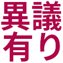

# Slack TB Decomoji

## List
|デコ文字|ファイル名|日本語|
|:---:|:---:|---|
||attouteki|圧倒的|
||conflict|コンフリクト|
||context|コンテキスト|
||degrade|デグレ|
||dry|DRY|
||english|英語|
||funky|Funcky|
||hantai|反対|
||i_want_you|君が欲しい|
||igiari|異議あり！|
||kansha|感謝|
||karano|からの|
||kyoka_shazai|許可より謝罪|
||lgtm|LGTM|
||matta|待った！|
||mijikai|短い|
||nagai|長い|
||rock|ロック|
||saiko|最高かよ|
||sansei|賛成|
||todo|TODO|
||unknown|知らなかった|
||wet|WET|
||wip|WIP|
||yagni|YAGNI|
